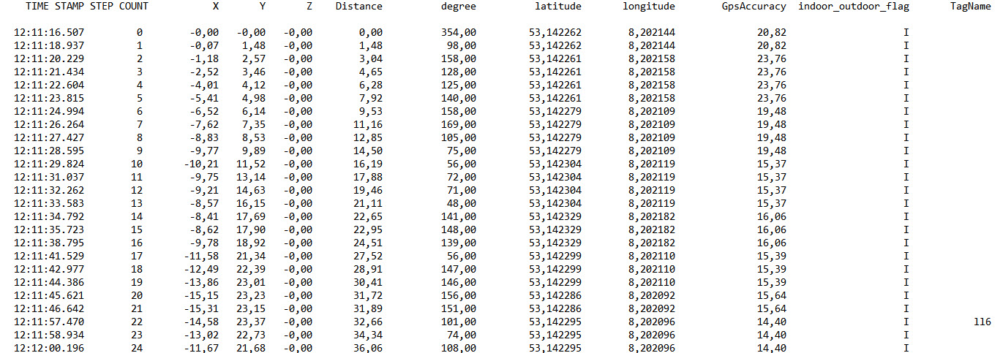
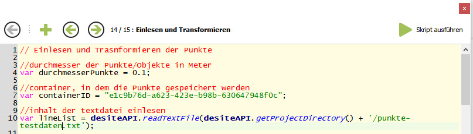
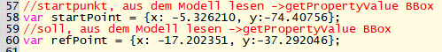
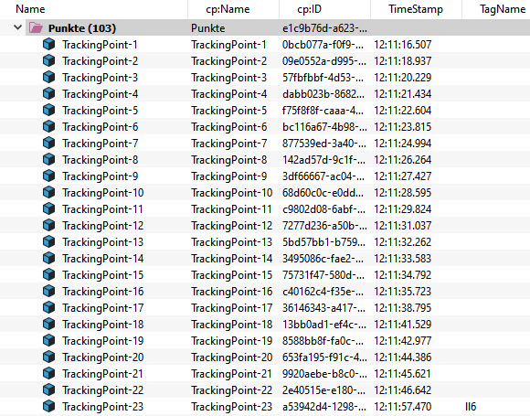
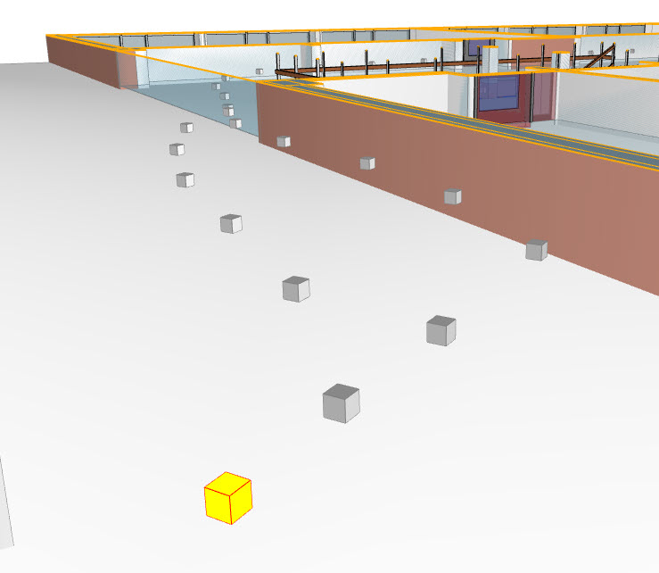

# Indoor Navigation mit Desite

Die Daten des Trackers liegen als Textdatei (punkte-testdaten.txt) vor. Diese Datei muss in dem Ordner des dazugehörigen Desite-Projektes gespeichert werden.

Als nächstes wird ein Container in Desite angelegt, in dem die Punkte später gespeichert werden. Die cp:ID des Containers wird in das Skript übernommen.

Vor der Ausführung des Skriptes kann der Durchmesser der Punkte, die ID des Containers und der Pfad zu der Textdatei mit den Daten des Trackers angepasst werden.

Schließlich werden die Koordinaten zweier Refernzepunkte angegeben, die als Basis der Translation verwendet werden.

Das Skript legt für jeden Punkt in der Textdatei ein Objekt innerhalb des Containers an und fügt als Attribute den Timestamp und den Namen des Tags hinzu.

Auf Basis der Referenzpunkte erfolgt die Translation der Objekte auf die korrekte Positio im Modell.

